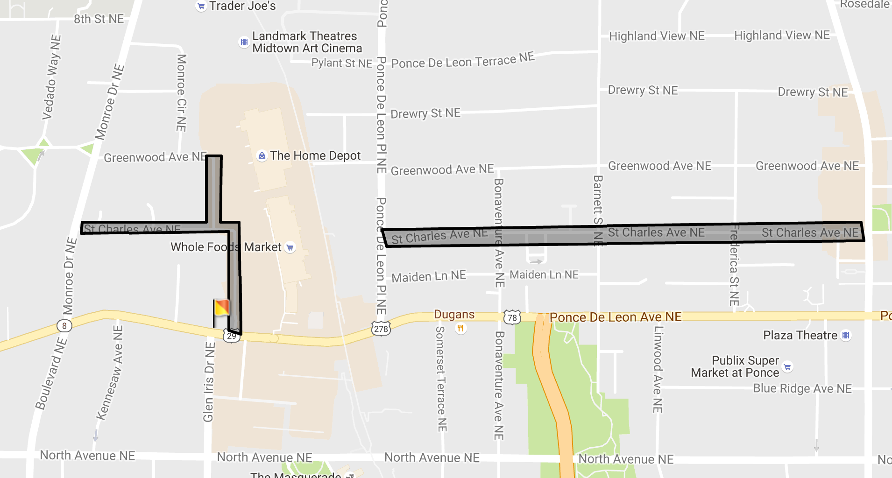

# Project FreeSpot

<!-- ### [New Dev branch: Heroku April 2017](https://park4-pwa.herokuapp.com/) -->
### [Live Original Deployment - Heroku October 2016](https://freespot.herokuapp.com/)

### Quickstart:

* Ensure necessary dependencies are installed:
 * [Ruby](https://www.tutorialspoint.com/ruby-on-rails/rails-installation.htm)
    * [Bundler](https://bundler.io/)
 * [Rails](https://www.tutorialspoint.com/ruby-on-rails/rails-installation.htm)
 * [PostgreSQL](https://www.tutorialspoint.com/ruby-on-rails/rails-installation.htm)

**In Terminal:**

 1. Clone the repository `git clone https://github.com/airbr/park4.git`
 2. Ensure all major dependencies above are installed (also that the bundler gem is installed if not via `gem install bundler`) 
 3. Install Ruby gems `bundle install`
 4. Run the Databas statart script `sh dbbuild.sh` to create the development database and run migration scripts.
 5. Start the Rails server `rails s`
 6. Open the app in your browser at `localhost:3000`
 7. Start FreeSpotting!

## Desktop Landing Page

## Responsive / iPhone sample

## Summary

FreeSpot is a Ruby on Rails App in development aimed at the issue of finding and sharing knowledge about parking with strong consumption and integration of the Google Maps API. 

Free Spot incorporates responsive design using the Foundation Framework and custom form features for the variety of different potential parking situations aimed at our intended user.

The App incorporates full CRUD features on parking 'Spot' objects and allows all users to see spots placed onto a globally viewable map. Users also have the ability add comments to spots that other users have added to this map.

### Future Development- 

We view the ability to incorporate 'fun' interaction via the Google Maps Drawing Library could particularly add value to the experience. We have experimented with some success with creating maps and saving them in certain states using resources that are not committed to this repo via `gitignore`.

In the following example, we would allow users to create detailed zone maps using the Google Maps Drawing Library and be able to save those created maps, and allow these to be accessed globally by all users.

As at present, this seems very possible but more difficult than current resources and time allow.

##### Partial wireframe:

>Use case: These are the best free parking spot zones near Ponce City Market. The Flag indicates (and would have more detail in this feature) that it is a one way exit onto Ponce De Leon. 

## Development Team

Team members:

* [Morgan Murrah](https://github.com/airbr)
* [Leslie Hochsztein](https://github.com/lhochsz)
* [Kirsten Humphreys](https://github.com/kirstenhumphreys)

The original [Trello Board](https://trello.com/b/O3ZXyAv8/project4-railsapi) from this project is available at that link.

## Technical Specifications

Update April 2017: The park4 app is still completely functional and works with some newer versions of Ruby and Rails. However, there are some new issues including deprecated usage of Fixnum/Bignum causing at minimum a lot of warning messages and some now incompatible CSS styles and others. Minor changes including adding a simple build script.

[**Ruby on Rails App originally created for Project 4, WDI 7:**](https://github.com/ATL-WDI-Curriculum/projects/blob/master/project4.md)

### Technologies used inclgit ude:

* ruby 2.4.1p111 (2017-03-22 revision 58053) [x86_64-darwin16]
    * ~~Ruby 2.3.1p112 (2016-04-26 revision 54768 (As at Oct 7 2016)~~
* Rails 5.0.1
    * ~~Rails 5.0.0.1~~
* psql (PostgreSQL) 9.6.2

* Ruby/Rails Gems including:
	* [Google Maps for Rails](https://github.com/apneadiving/Google-Maps-for-Rails)
	* Bootstrap Generators
	* Pry
	* Sass
  * Devise for AuthN and AuthZ

* [Foundation CSS Framework](http://foundation.zurb.com/)
